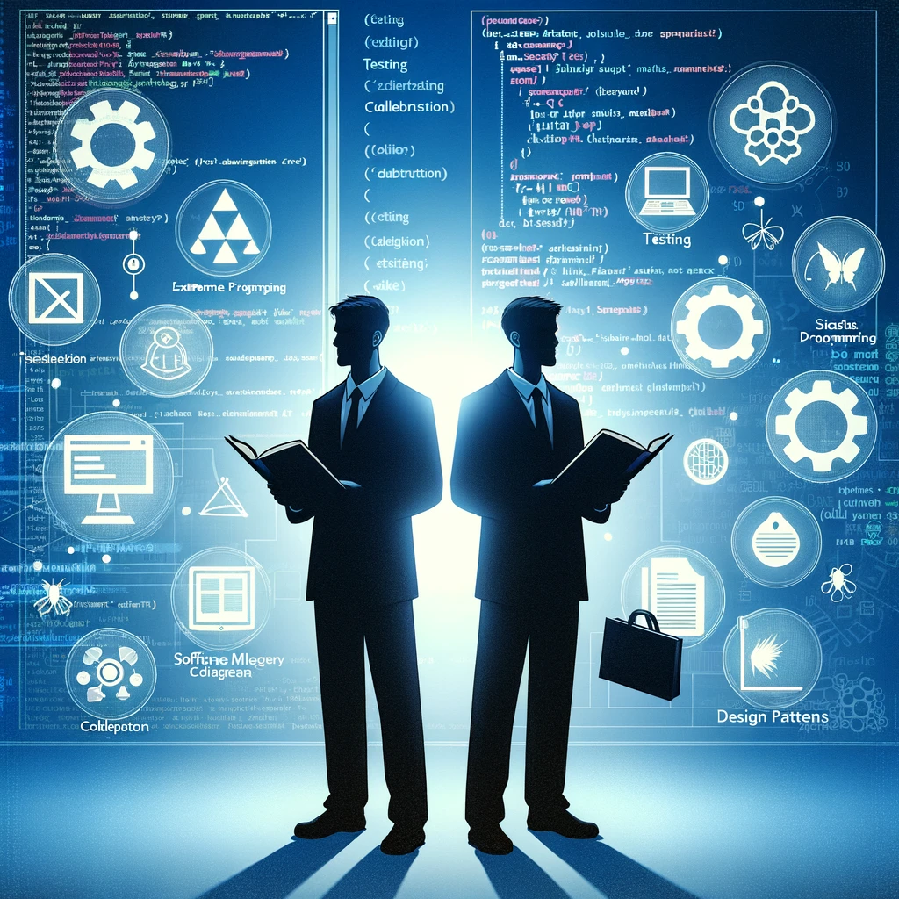

#  Programming  new thing chassnge

A high level Overview on What is programming and what are all the topics you should be learning

---
Modules

1. [Introduction to Programming](#1---introduction-to-programming)
1. [Programming Languages](#2---programming-languages)
1. [History of Programming](#3---history-of-programming)
1. [Understanding Code Structure](#4---understanding-code-structure)
1. [Algorithms and Logic](#5---algorithms-and-logic)
1. [Control Structures](#6---control-structures)
1. [Debugging and Error Handling](#7---debugging-and-error-handling)
1. [Development Environments](#8---development-environments)
1. [Version Control Systems](#9---version-control-systems)
1. [Data Structures](#11---data-structures)
1. [Object](#12---object-oriented-programming-(oop))
1. [Functional Programming](#13---functional-programming)
1. [Event](#14---event-driven-programming)
1. [Concurrent and Parallel Programming](#15---concurrent-and-parallel-programming)
1. [Web Development](#16---web-development)
1. [Mobile App Development](#17---mobile-app-development)
1. [Database Management](#18---database-management)
1. [Security in Programming](#19---security-in-programming)
1. [Continuous Integration/Continuous Deployment (CI/CD)](#21---continuous-integration/continuous-deployment-(ci/cd))
1. [Cloud Computing](#22---cloud-computing)
1. [Open Source Software](#23---open-source-software)
1. [Programming Communities](#24---programming-communities)
1. [The Future of Programming](#25---the-future-of-programming)

---

# 1 - Introduction to Programming

Programming is the process of creating a set of instructions that tell a computer how to perform a task.

---

# 2 - Programming Languages

Programming languages are tools that allow humans to communicate with computers using a syntax that the computer can interpret and execute.

---

# 3 - History of Programming

A brief overview of how programming languages have evolved from machine code to modern high-level languages.

---

# 4 - Understanding Code Structure

Exploring the basic structure of code, including syntax, variables, data types, and functions.

---

# 5 - Algorithms and Logic

The role of algorithms in programming and how they are used to solve problems and perform calculations.

---

# 6 - Control Structures

Introduction to conditionals and loops, which control the flow of a program.

---

# 7 - Debugging and Error Handling

Techniques for finding and fixing errors in code, and how to handle unexpected situations gracefully.

---

# 8 - Development Environments

An overview of Integrated Development Environments (IDEs) and how they help programmers write and test their code.

---

# 9 - Version Control Systems

The importance of version control in managing changes to code, with a focus on Git.

---

# 10 - Software Development Methodologies

A look at different approaches to organizing and managing programming work, such as Waterfall and Agile.

---

# 11 - Data Structures

Understanding common data structures such as arrays, lists, stacks, and queues.

---

# 12 - Object-Oriented Programming (OOP)

The principles of OOP, including classes, objects, inheritance, and polymorphism.

---

# 13 - Functional Programming

Introduction to functional programming and how it differs from OOP.

---

# 14 - Event-Driven Programming

How events and callbacks are used to handle user interactions and other asynchronous activities.

---

# 15 - Concurrent and Parallel Programming

Exploring concepts of concurrency and parallelism in programming.

---

# 16 - Web Development

Overview of client-side vs. server-side programming for the web.

---

# 17 - Mobile App Development

Introduction to the world of mobile app programming for platforms like iOS and Android.

---

# 18 - Database Management

The role of databases in programming and an introduction to SQL.

---

# 19 - Security in Programming

Understanding the basics of cybersecurity and secure programming practices.

---

# 20 - Software Testing

The different levels of software testing, from unit tests to integration tests.

---

# 21 - Continuous Integration/Continuous Deployment (CI/CD)

Explaining CI/CD pipelines and their importance in modern development workflows.

---

# 22 - Cloud Computing

How cloud services have changed the way we develop and deploy applications.

---

# 23 - Open Source Software

The importance of open-source software in the programming community.

---

# 24 - Programming Communities

Finding support and collaboration opportunities in programming communities and platforms like GitHub.

---

# 25 - The Future of Programming

Speculating on future trends in programming, including AI and machine learning.

---

# Why should i work 

Speculating on future trends in programming, including AI and machine learning.
