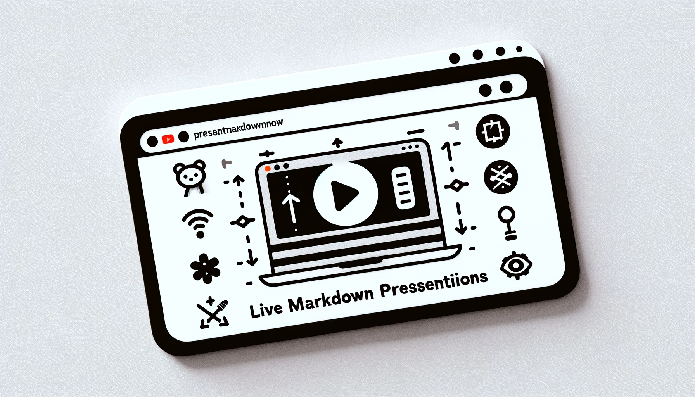

# PresentMarkdownNow

Effortlessly stream and present your Markdown slides live in-browser with PresentMarkdownNow. Ideal for educators, presenters, and anyone needing to create dynamic, real-time presentations. Simply write in Markdown, and let PresentMarkdownNow handle the live presentations!

## Features

- **Live Streaming**: Instantly stream your Markdown slides live in your browser.
- **Typewriter Effect**: New changes appear with a captivating typewriter effect.
- **Marp CLI Compatibility**: Create slides with simple Markdown or Marp CLI format.
- **Easy Access**: View the latest slide at `http://localhost:9500`.
- **Full Presentation Download**: Download your entire presentation anytime.

## Demo
[](https://youtu.be/Uaxzf9ZFd_k)


## Installation

Install PresentMarkdownNow using npm:

```bash
npm install present-markdown-now
```

Or run it directly with npx:

```bash
npx https://github.com/muthuishere/present-markdown-now.git
npx present-markdown-now
```

## Usage

Navigate to a folder containing your markdown file and run:

```bash
present-markdown-now
```

If the folder contains one markdown file, it will automatically be served. To specify a file:

```bash
present-markdown-now path/to/your/file.md
```

## Example

Create a Markdown file (e.g., `presentation.md`) and run:

```bash
present-markdown-now presentation.md
```

Open your browser and go to `http://localhost:9500` to see your live presentation.

## Credits and Acknowledgements

Special thanks to the following projects for their invaluable contributions to PresentMarkdownNow:

- [Marp CLI](https://www.npmjs.com/package/@marp-team/marp-cli): For enabling seamless markdown to presentation conversions.
- [Typewriter Effect](https://www.npmjs.com/package/typewriter-effect): For adding dynamic typewriter effects to live presentations.

## Third-Party Licenses

For information on third-party licenses used in PresentMarkdownNow, please refer to the [Third Party Licenses](THIRD-PARTY-LICENSES.txt) page.


## Contributing

Contributions, issues, and feature requests are welcome! Feel free to check [issues page](https://github.com/muthuishere/present-markdown-now/issues).

## License

[MIT](LICENSE)
